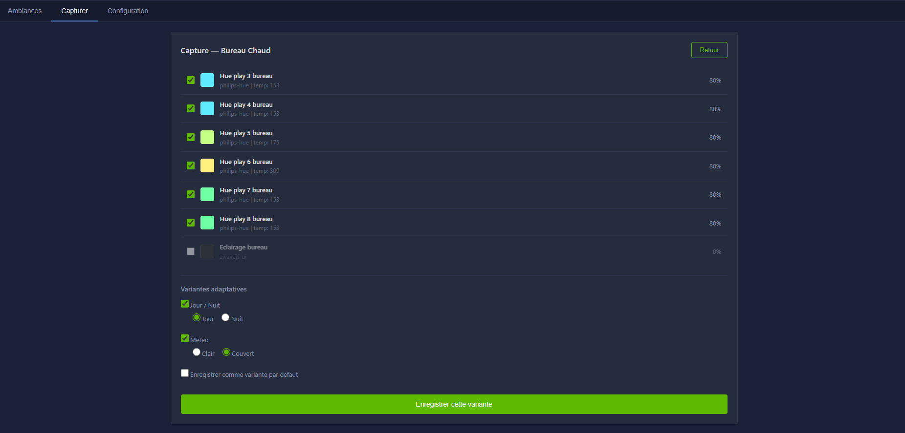

# Scenes Manager

Gestionnaire d'ambiances intelligent pour [Gladys Assistant](https://gladysassistant.com/).

Capture l'etat de vos lumieres, stocke des presets et applique automatiquement la bonne variante selon les conditions (jour/nuit, meteo).




## Concept

- **Gladys** decide **QUAND** (triggers, horaires, presence, bouton dashboard)
- **Scenes Manager** decide **COMMENT** (quelle variante d'ambiance appliquer)

Le Scenes Manager ne connait aucun protocole. Il utilise l'API Gladys comme couche d'abstraction universelle : si Gladys controle votre lumiere, le Scenes Manager la gere — Philips Hue, Z-Wave, Zigbee, MQTT, Tuya, Matter, etc.

## Fonctionnalites

- **Capture en 1 clic** : scanne toutes les lumieres d'une piece via l'API Gladys, affiche couleurs et luminosite
- **Variantes adaptatives** : enregistrez plusieurs versions d'une meme ambiance (jour/nuit, ciel clair/couvert)
- **Selection intelligente** : a l'appel, le Scenes Manager check la meteo et le soleil, puis applique la bonne variante
- **Fallback** : si une combinaison de conditions est manquante, utilise un match partiel ou la variante par defaut
- **Interface web** : dark theme inspire de Gladys, responsive, PWA-friendly
- **API REST** : chaque ambiance expose un endpoint, copiable en 1 clic dans l'UI
- **Switches MQTT** : integration optionnelle via devices MQTT virtuels dans Gladys

## Installation

### Prerequis

- Gladys Assistant v4+
- Docker
- (Optionnel) Cle API [OpenWeatherMap](https://openweathermap.org/api) gratuite pour les variantes meteo

### 1. Creer une API Key Gladys

Allez dans **Parametres -> Sessions** dans Gladys et creez une nouvelle cle API.

### 2. Cloner et builder

```bash
git clone https://github.com/VOTRE_USER/gladys-scenes-manager.git
cd gladys-scenes-manager
docker build -t scenes-manager .
```

### 3. Configurer

Creez un fichier `presets.json` :

```json
{
  "config": {
    "gladysUrl": "http://localhost:8585",
    "gladysApiKey": "VOTRE_API_KEY_GLADYS",
    "latitude": 48.8566,
    "longitude": 2.3522,
    "openWeatherMapApiKey": "",
    "weatherCacheDuration": 600000,
    "cloudyThreshold": 40
  },
  "scenes": {}
}
```

> Vous pouvez aussi configurer tout ca depuis l'interface web apres le lancement.

### 4. Lancer

```bash
docker run -d \
  --name scenes-manager \
  --network host \
  --restart unless-stopped \
  -v /chemin/vers/presets.json:/app/presets.json \
  -e TZ=Europe/Paris \
  -e PORT=8890 \
  -e MQTT_URL=mqtt://localhost:1883 \
  scenes-manager:latest
```

L'interface est accessible sur `http://VOTRE_IP:8890`.

## Utilisation

### Creer une ambiance

1. Reglez vos lumieres comme vous le souhaitez
2. Ouvrez le Scenes Manager -> **Capturer**
3. Selectionnez la piece, donnez un nom
4. **Scanner les lumieres** -> l'app affiche l'etat reel de chaque lumiere
5. Cochez/decochez les lumieres a inclure
6. (Optionnel) Cochez **Jour/Nuit** et/ou **Meteo** pour creer une variante
7. **Enregistrer**

Pour ajouter des variantes : changez vos lumieres, cliquez **Rafraichir**, selectionnez les nouvelles conditions, enregistrez.

### Appeler depuis Gladys

Chaque ambiance affiche son chemin API (cliquez pour copier). Dans Gladys, creez une scene :

| Champ | Valeur |
|-------|--------|
| Action | Faire une requete HTTP |
| Methode | `POST` |
| URL | `http://localhost:8890/scenes/soiree-chambre/apply` |

Le Scenes Manager selectionne automatiquement la bonne variante.

### Exemples de scenes Gladys

```
Scene "Ambiance soiree"
  Trigger : coucher du soleil
  Actions :
    1. POST http://localhost:8890/scenes/soiree-chambre/apply
    2. POST http://localhost:8890/scenes/soiree-salon/apply
```

## API

| Methode | Endpoint | Description |
|---------|----------|-------------|
| `GET` | `/scenes` | Liste les ambiances |
| `POST` | `/scenes/:key/apply` | Applique (selection intelligente) |
| `POST` | `/scenes/:key/apply-force` | Force une variante `{ "variant": "Nuit + Clair" }` |
| `GET` | `/capture/devices?room=Chambre` | Lumieres d'une piece avec etat |
| `POST` | `/capture` | Enregistre un snapshot |
| `GET` | `/weather` | Conditions actuelles |
| `GET` | `/status` | Etat du systeme |
| `GET/PUT` | `/config` | Configuration |
| `GET` | `/rooms` | Pieces disponibles |

## Performances

| Operation | Temps |
|-----------|-------|
| Capture 20 devices | ~80 ms |
| Appliquer 6 Hue en parallele | ~70 ms |
| Appel meteo (cache 10 min) | ~250 ms |

## Protocoles testes

| Protocole | Status | Features |
|-----------|--------|----------|
| Philips Hue | OK | on/off, brightness, color, temperature |
| Z-Wave (Fibaro Dimmer) | OK | dimmer 0-99 |
| MQTT (Magic Home) | OK | on/off, brightness, color |
| Tuya | OK | on/off |
| Zigbee (Zigbee2MQTT) | Devrait fonctionner | selon le device |

## Stack

- **Node.js 22** Alpine (~25 Mo RAM)
- **mqtt.js** + **suncalc** (seules dependances)
- **Frontend** : HTML/CSS/JS vanilla, dark theme Gladys
- **Donnees** : fichier JSON

## Licence

MIT

---

Developpe avec [Claude Code](https://claude.ai/claude-code) pour la communaute [Gladys Assistant](https://gladysassistant.com/).
